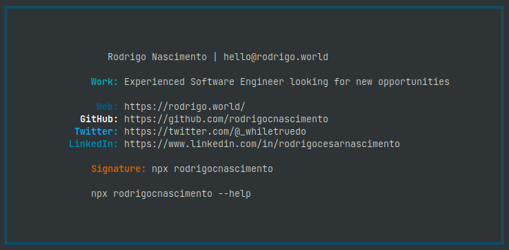

# Rodrigo Nascimento

<p align="center">
    
</p>

Package que cria uma assinatura para ser exibida no terminal como um cartão pessoal. O exemplo foi baseado no repo do **[Guilherme Esteves](https://twitter.com/guilhermesteves)**

Esse projeto encontra-se disponível no site do **npm** pelo link: [rodrigocnascimento](https://www.npmjs.com/package/rodrigocnascimento)

### Execute com o npx

```bash
    npx rodrigocnascimento
```

Caso você não tenha o **npx**, basta instalar globalmente:

```bash
    npm install -g npx
```

O **npx** é uma ferramenta que te permite rodar pacotes direto na linha de comando sem a necessidade de instalá-los.

Para mais

```bash
    npx rodrigocnascimento --help
```

Changelog:

- v2
  - Adicionados lugares onde já trabalhei;
  - Implementado um joguinho :3 básico;
  - Organização da estrutura do código
